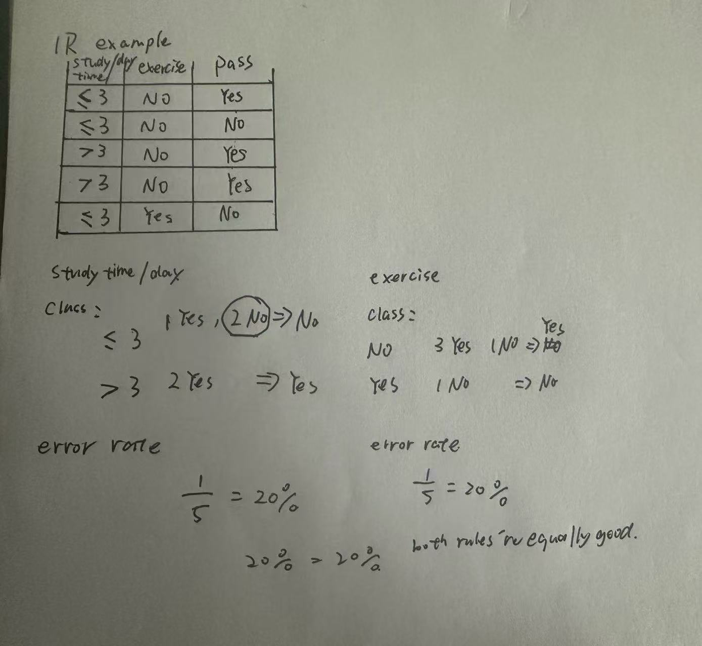

# Machine Learning Notes

This repository contains my machine learning study notes, worked examples, and small coding practice in Python.

Topics I plan to include:
- 1R 
- Decision Trees
- Logistic Regression
- KNN
- Model Evaluation
- Clustering

## 1R
The 1R (One Rule) algorithm is a simple, highly interpretable classification machine learning algorithm that generates a set of rules based on the single most informative input attribute.

steps: 
step1:Look at one attribute at a time

step2: For each value of that attribute, find the most common class

step3: Make a rule for that attribute

step4: calculate error rate 

step5: Repeat for every attribute

step6: Choose the attribute with the fewest mistakes(if error rate are equal, then we can choose random one)

